## Integrate Payment with Flutterwave and Facebook Authentication into a React Application.

Hey there you have gone through the [react documentation](https://reactjs.org/docs/getting-started.html) and some resources over the internet and you are ready to put this knowledge to use. In this tutorial, we are going to integrate Facebook Login and Flutterwave V3 rave API in a react application. So I have this site under construction spyo.com, a campaign platform where brands get support from their fans in a bid to grow. Spyo is built using [NextJs](https://nextjs.org/) - A framework for building react applications, [MongoDB](https://www.mongodb.com/) a document-based database, the  [Bulma](https://bulma.io/) react UI library kit and  Flutterwave's Rave Card payment API. [Flutterwave](https://www.flutterwave.com/) is an African payment solution provider to make and accept payments from customers anywhere in the world. By the end of this tutorial, you should have built some parts of Spyo, and learned some underlying react concepts. The tutorial will cover authentication with Facebook, and the integration of payment with Flutterwave.

### React concepts
In this tutorial we are going to cover the following react components or concepts.shall cover in this tutorial.
- React funtional components
- Props
- Hooks
- Ref
- Suspense
- Lazy loading

## Lets get started
### Installing required applications to run application
The first step to this tutorial will be installing all relevant dependencies. Make sure you have the following installed [Node Js](https://nodejs.org/en/download/) for running the base application we shall be building on, [Mongo](https://docs.mongodb.com/manual/installation/) for application database, [git](https://git-scm.com/downloads) to clone the base app repository. After installing all dependencies required to run the app, the next step is to clone the application.

### Cloning base app repo
Open your terminal and change to the directory on your PC you wish to clone the app and run the git clone command.
```markdown
git clone --recursive https://github.com/tanerochris/spo-tuto-base.git
```
Install dependencies with yarn
```markdown
yarn install
```
### Running the app
When you are done cloning, the name of application folder will be spo-tuto-base. Change to the spo-tuto-base directory and run yarn to start the application. We will start by running the application in developer mode.
```markdown
    cd spo-tuto-base
    yarn dev
```
In your browser go to the url **http://localhost:3000**, you should see the base interface we shall be building with. To focus only on the essential react concepts to be presented in this writeup we have setup the application with some design and functionality already.

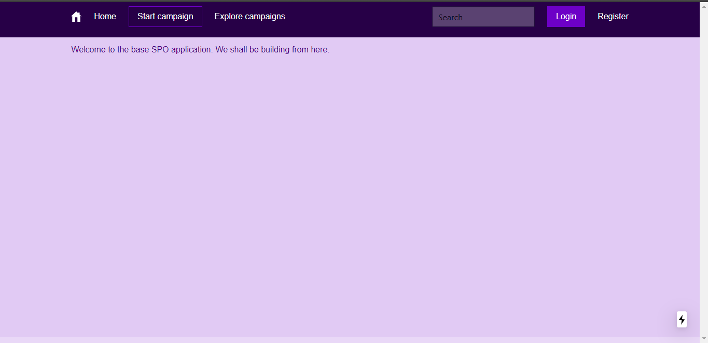

To run the application in production mode, you first build the app for optimizations by NextJS framework then run app.

```markdown
    yarn build
    yarn start
```

NextJS comes with react installed. To check for the version of react installed, open a new terminal session
```markdown
    yarn list --pattern --depth=0 "^react*"
```
You should see the version of react installed together with other react packages. In my own case the above command produces the following output at the terminal. Notice we are working with version 16.13.1 of the react library which is currently the [latest](https://reactjs.org/versions/) at the time of this writing.
 
```markdown
    $ yarn list --pattern --depth=0 "^react*"
    yarn list v1.22.4
    warning Filtering by arguments is deprecated. Please use the pattern option instead.
    ├─ react-dom@16.13.1
    ├─ react-is@16.13.1
    ├─ react-refresh@0.8.3
    └─ react@16.13.1
    Done in 1.67s.
```

### Structure of the application
We are going to look at the struture of the app, where each item will fit in, some screen shots at the output we wish to obtain.

```
.
|-- LICENSE // hello
|-- README.md
|-- app.properties
|-- components
|   |-- partials
|   `-- theme
|-- helpers
|-- middlewares
|   |-- Database.js
|   |-- Session.js
|   `-- index.js
|-- models
|   `-- user
|-- node_modules
|-- package.json
|-- pages
|   |-- _app.js
|   |-- api
|   `-- index.js
|-- public
|-- schemas
```
NextJs is an opinionated  framework, it requires the pages and public folders to be present in the directory structure and located at the root level. We will add other directories to hold specific items of our application. Below is a summary detail of what each directory should contain. Note this is not specific to react or NextJS so you can define your own structure.

- The _pages_ directory will hold the different web pages of our application, and api endpoints which will go under the pages/api directory. NextJs uses a file name pattern for url routing where each page or api is associated to a route based on its file path from the pages folder.
- The _public_ directory hosts static assets such as images, fonts just to name a few. The component folder holds application ui or page components such as partials and theme.
- The _models_ folder to hold MongoDB data models the application data.
- A _helper_ folder to hold utility functions.
- A _middlewares_ folder to hold api routes middleware functions.
- An _app.properties_ file to hold variables that will be used across the app.

## Let's start building with react
### Building the Signup - Authenticating with Facebook Login
In react application is broken down into components were each component can be seen as an independent re-usable piece of code. In react there are two types of components functional components and class components. In this tutorial we shall using functional components as they allow us to use the concepts of hooks. Functional components are stateless components while class components are stateful as the come with a built-in component state object. Functional components make use of the useState hook to implement state to a component.

#### Class component
```markdown
    import React from 'react';

    class Signup extends React.Component {
        state = {}
        render() {
            return <>
                A React Class Component.
            </>
        }
    }
    export default Login;
```
#### Functional Component
```markdown
    import React from 'react';
    
    const Login = (props) => {
        return <> 
            A react functional component.
        </>
    }
    export default Login;
```

#### props vs state
In react the props object is used to pass information from a parent component to a child component. Attributes of a component become keys in the props object and the passed values are accessed through these attribute keys. In a react class component the prop object is imutable unlike the case of functional components. React class components manage component state by using the state property and setState method to update the state.

Now we are going to create our SignUp component that will represent the Signup page and authenticate with Facebook Login.

#### Step 1
In the _pages_ folder create the file _signup.js_ and type in the following code.
```markdown
import axios from 'axios';
import FacebookLogin from 'react-facebook-login';
import { useRouter } from 'next/router';
import { getSession } from '../helpers/session-helpers';
import AppHeader from '../components/partials/appHeader';

const Signup = (props) => {
    const [errorMessage, setErrorMessage] = useState('');
    const router = useRouter();
    const onSignUpResponse = (response) => {};  
    return (
        <>
            <AppHeader session={props.session}/>
            <main>
                <div className="alert-error">
                    <span>{errorMessage}</span>
                </div>
                <div className="auth-container bg-secondary" >
                    <div>
                        <FacebookLogin  
                            appId="635054340432342"
                            autoLoad={false}
                            textButton=" Register with Facebook" 
                            fields="name,email,picture"
                            callback={onSignUpResponse}
                            cssClass="social-button fb-button"
                            icon="fab fa-facebook-square" />
                    </div>
                </div>
            </main>
        </>
    );
  }

function isBrowser() {
    return typeof window !== 'undefined';
}

export async function getServerSideProps( { req, res }) {
    const sessionString = await getSession(req, res);
    const session = JSON.parse(sessionString);
    if (!isBrowser() && session.user) {
      res.writeHead(302, { Location: '/' });
      res.end();
    }
    return { props: { session }}
}
export default Signup;
```

#### Step 2
Install the _react-facebook-login_ package for Facebook login button and the _axios_ package to make api calls to save user credentials.

```markdown
    yarn add react-facebook-login axios
```
To authenticate with facebook you need to go to [developers.facebook.com]() and create an application to have an app id. Copy your app Id and make it the value of the appId attribute of the FacebookLogin component above. Here is an online that [tutorial](https://webkul.com/blog/how-to-generate-facebook-app-id/) that shows how you can generate an appId for your app. When you are done setting up your app and updating the appId  property of the FacebookLogin button, reload the Signup page. You should have the result below.

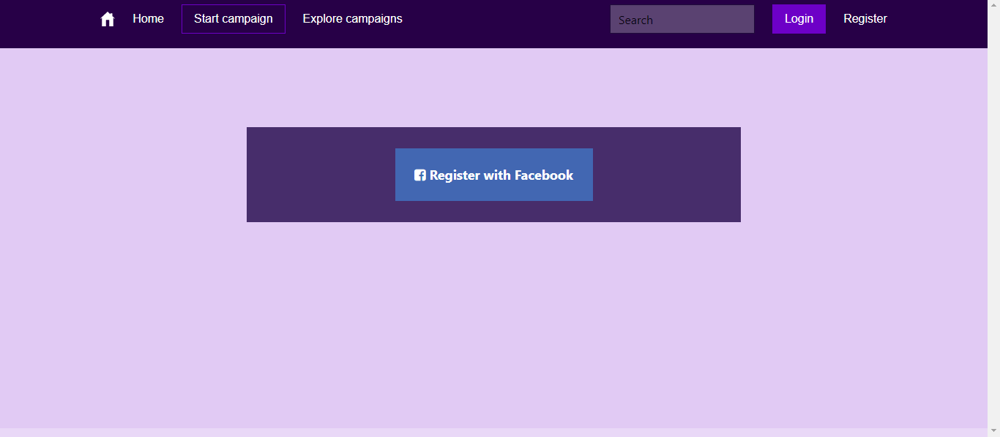

**Notice** the isBrowser and getServerSideProps functions, isBrowser tests if the component is running from a server or browser window and getServerSideProps is a NextJs function to pass properties to the client component on server-side rendering. We can have our sign up component without the above functions, but in our case we want to track if a user has an active session and redirect the user to the index page. We are using the NextJS router and useState when we cover react hooks later in the tutorial. 

Data returned by the getServerSideProps function is passed as an argument to the Signup functional component. This argument represents the properties of the functional component. Props properties can also be passed to other child components as attributes as we can observe with the ```<AppHeader session={props.session} />```.

```markdown
    <AppHeader session={props.session} />
```
#### Step 3
Now let's connect the signup with the backend to save registered users to the database. The base app backend is already setup for authentication. Replace the ```onSignUpResponse``` callback with the following code.

```markdown
    const onSignUpResponse = (response) => {        
        if (!response.id) {
            // prints error to screen
            setErrorMessage('Unable to sign up to Facebook.');
            return false;
        }
        const postBody = { ...response, providerAccessToken: response.accessToken, provider: 'facebook'};
        return axios({
            method: 'POST',
            url: '/api/user/signup',
            postBody,
            validateStatus: () => true
        })
        .then((res) => {
            if (res.status === 200) {
                // redirect to login page
                router.push('/login');
            } else {
                setErrorMessage(res.data.message);
            }
        })
        .catch((error) => {
            setErrorMessage(error);
        });
    };
```
For the Facebook button to work properly we need to do one more thing.

#### Step 4
Facebook authentication must be done over https. To be able to that on localhost we will need to download [Ngrok](https://ngrok.com/download) to expose our server to the internet, this will equally create an https link we can use as domain on our facebook app settings.
When you must have downloaded ngrok, save the executable in your project folder or where you can easily reach it. I saved mine one directory above my project. Make sure the spo-tuto application is running, copy the port number and in your terminal run the ngrok program.
```markdown
    ../ngrok.exe http 3000
```
Ngrok will create a proxy to your local server. For the free account the generated link is valid for 7 hours 49 minutes.

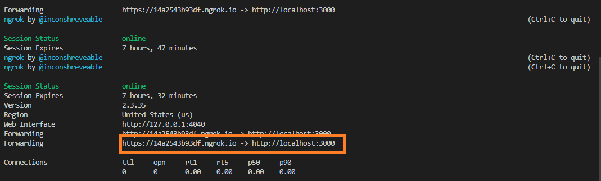


#### Step 5
Copy the https link, go to the dashboard of the Facebook app you created earlier, follow _Settings > Basic_ scroll down to _Website_ and update the site URL field. Note if you don't do this Facebook will not recognize the domain accessing its auth service and your login will fail and Login with facebook will not work.

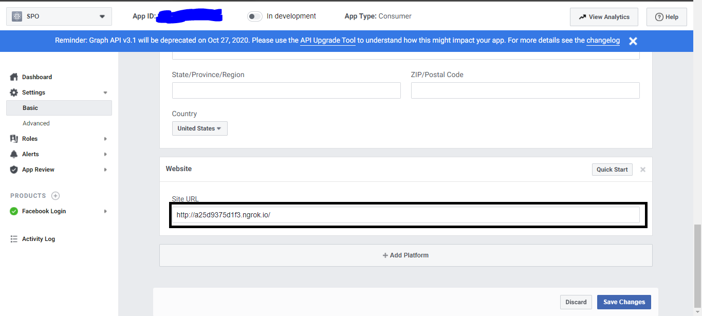


#### Step 6
Now we go to the browser link to the secured link generared by ngrok. Try to Register with Facebook, the users object is returned with information concerning the user such as Name, email, id and profile picture, which is saved to the database and redirects us to the login page.

The login page has been implemented, open _pages/login.js_ you will notice there is no significant difference with the signup page. Separating both files was to allow for subsequent updates on other means of authentication and equally separating the login process from the signup process. After login with Facebook you should see the index page.

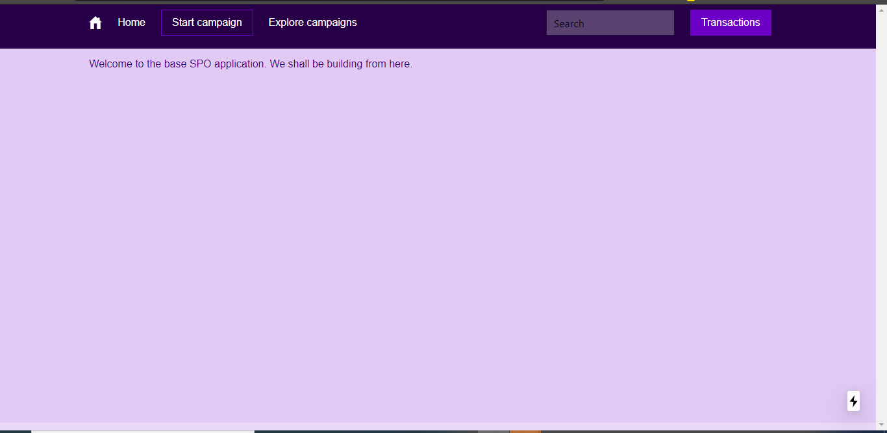

### Intergrating Flutterwave
We are now going to integrate Card payments with Flutterwave in our application. Some react concepts we will come across are react hooks, how to manipulate the Virtual DOM, suspense and lazy loading.
#### Hooks
Before integrating Flutterwave lets first talk about Hooks. Hooks were introduced in react version 16.8 , to give developers the ability to manipulate state and  use react features in functional components. In this tutorial we look at some of the common hooks useState, useEffect and useRef. 
- **_useState_** hook is an api that allows the user to manage component state. That is if you have a state variable (a variable you want to track when it changes and update accordingly), useState will initialise the variable and return a function you can use to update the variable.
```markdown
    const [variableName, setVariableState] = useState('initialValue')
```
The function setVariableState will be used to update the variable.
- **_useEffect_**  hook accepts a function and runs this function during a render phase or when component state changes. You can pass a useEffect an array of state variables, useEffect will run the passed function each time any of these variables changes. Passing an empty array will make useEffect to run just once. You can have many useEffect calls in your component.
```markdown
    useEffect( () => {
        // this function will be run everything as application is rerendered.
    })
```
- **_useRef_**  hook is used to manipulate DOM, it is recommendated not to over use it. React uses a virtual DOM, useRef api will give the programmer access to the real DOM elements.
#### Step 1: Building the Transaction and Payment widget
The Transaction component will make use of hooks. The transaction page will contain the list of payments made to the platform. Also we will create a paymentWidget which will be called from the payment modal. Users of SPYO top up their accounts with cash which they can later use on the platform to either reward fans who support their campaign or support businesses to reward fans.

Create a file _pages/transactions.js_ and write in the following code.
```markdown
// pages/transactions.js

import { useState, useEffect, useRef } from 'react';
import path from 'path';
import mongoose from 'mongoose';
import PropertiesReader from 'properties-reader';
import { getSession } from '../helpers/session-helpers';
import AppHeader from '../components/partials/appHeader';

function isBrowser() {
    return typeof window !== 'undefined';
}
const  Transactions = ({session, currency, errorMessage, topUpQuota}) => {
    const [error, setErrorMessage] = useState('');
    const [runningBalance, setRunningBalance] = useState(0.0);
    const [totalBalance, setTotalBalance] = useState(0.0);
    const [transactions, setTransactions] = useState([]);
    const paymentModalRef = useRef(null);
    const openPaymentModal = () => {
        paymentModalRef.current.classList.add('is-active');
    }
    return <>
        <AppHeader session={session} errorMessage={error || errorMessage} />
        <main className="columns">
            <aside className="column is-hidden-mobile"></aside>
            <article className="column is-two-thirds bg-default transaction-container">
                <div className="transaction-header bg-primary">
                    <div className="header">
                        <h2 className="">Transactions</h2> <button className="button is-accent" onClick={openPaymentModal}>Top Up</button>
                    </div>
                    <div className="columns sub-header">
                        <div className="column balances">
                            <span class="total is-text-warning">Balance: {totalBalance} &nbsp;{currency}</span>
                            <span class="running">Running: {runningBalance} &nbsp;{currency}</span>
                        </div>
                        <div className="column filters is-hidden-mobile">
                        </div>
                    </div>
                </div>
                <div className="transaction-content">
                        <table class="table is-bordered">
                            <thead className="bg-primary">
                                <th>#Ref</th>
                                <th>Reason</th>
                                <th>Amt / {currency}</th>
                                <th>Balance / {currency}</th>
                                <th>Date</th>
                            </thead>
                            <tbody>
                                {
                                    transactions ? 
                                        transactions.map( (transaction, index) => 
                                            <tr key={index}>
                                                <td>{transaction.serial}</td>
                                                <td>{transaction.reason}</td>
                                                <td>{transaction.amount}</td>
                                                <td>{transaction.amount - topUpQuota*transaction.amount}</td>
                                                <td>{transaction.createdAt}</td>
                                            </tr>) : <tr>No transaction.</tr>
                                }
                            </tbody>
                        </table>
                </div>
            </article>
            <aside className="column is-hidden-mobile"></aside>
        </main>
    </>
}
export async function getServerSideProps( { req, res }) {
    const sessionString = await getSession(req, res);
    const session = JSON.parse(sessionString);
    const properties = PropertiesReader(path.resolve('app.properties'));
    // amount charged for each transaction to the user, ie. platform charges
    const paymentQuotaTopProp = 'payment.quota.topup';
    const paymentQuotaTop = properties.get(paymentQuotaTopProp);
    if (!isBrowser() && !session.user) {
        res.writeHead(302, { Location: '/login' });
        res.end();
    }
    const currency = session.user.currency || 'XAF';
    return {
        props: { 
            session,
            currency,
            topUpQuota: Number(paymentQuotaTop)
        }
    }
}
export default Transactions;
```
In the above code we used useState hook to create and intialize state variables _transactions_,_runningBalance_, _totalBalance_ and _errorMessage_. Next will be creating the PaymentModal and PaymentWidget components. Notice we already have an _openPaymentModal_ onClick handler to registered on the _Top Up_ button to make payments to the platform.

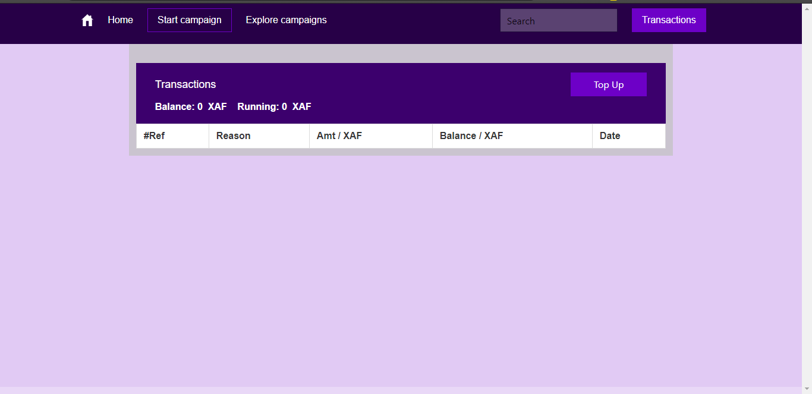

The PaymentCardWidget component has been included in the spo-tuto-base repo, it is found in the _component/partial/widgets/PaymentCardWidget.js_ file.

```markdown
// component/partial/widgets/PaymentCardWidget.js
import React, { useState, useRef } from 'react';
import { useRouter } from 'next/router';
import { usePaymentInputs } from 'react-payment-inputs';
import axios from 'axios';
import PaymentIcon from "react-payment-icons-inline";

import images from 'react-payment-inputs/images';

const PaymentCardWidget = ({currency, quota}) => {
    ...

    // initiate a payment request
    const createPaymentRequest = () => {
        ...
    }
    // submit extra data to start payment
    const initiatePayment = (payload) => {
        ...
    }   
    return <>...</>
}
export default PaymentCardWidget;
```
Create the modal component from which we are going to call the PaymentCardWidget component above.

```markdown
// component/partial/modal/paymentModal.js

import React, {useEffect, useRef} from 'react';
import PaymentCardWidget from '../widgets/PaymentCardWidget';
const PaymentModal = React.forwardRef((props, ref) => {
    const close = () => ref.current.classList.remove('is-active'); 
    return (
        <>
            <div class="modal payment-modal" ref={ref}>
                <div class="modal-background"></div>
                <div class="modal-content bg-default">
                    <PaymentCardWidget modal={ref} {...props} />
                </div>
                <button class="modal-close is-large"  aria-label="close" onClick={close} ></button>
            </div>
        </>
     )
})
export default PaymentModal;
```

We are almost done with the payment UI. Import the PaymentModal component into the Transaction Page. 
```markdown
    ...
    import PaymentModal from '../components/partials/modals/paymentModal';
    ...
```
Below the <table> closing tag, add the PaymentModal component.

```markdown
    <PaymentModal ref={paymentModalRef} {...{currency, paymentUrl, quota: topUpQuota}} />
```
Note the ref attribute, in react you will create a reference only on a native HTML tag, since the modal we are targetting is instead found in the PaymentModal componenent we will forward the reference to the div element present on the PaymentModal component. You should notice on the PaymentModal component is wrapped in React.forwardRef call. This also allows us to control the child DOM from the parent component as can be seen in the body of the _openPaymentModal_ function in _Transactions_ Page Component.

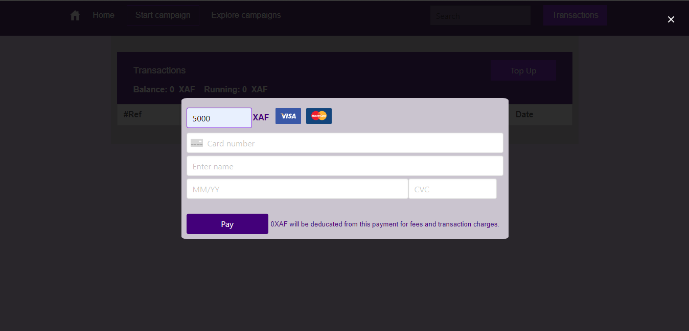


#### Step 2: Create an account on Flutterwave 
To integrate flutterwave api you will need to create and account on [Flutterwave](https://www.flutterwave.com/signup). 

1. Go to [Flutterwave](https://www.flutterwave.com/signup) and fill the signup form.
2. Check your email for verification link, you may have to check your spam for the email.
3. Follow the verification email, you will need to specify how you want to use Flutterwave to accept payment.
4. Select how you will want to accept payment from flutterwave. Select the option of your choice, for my case I chosed "To Accept Payment as an Individual".
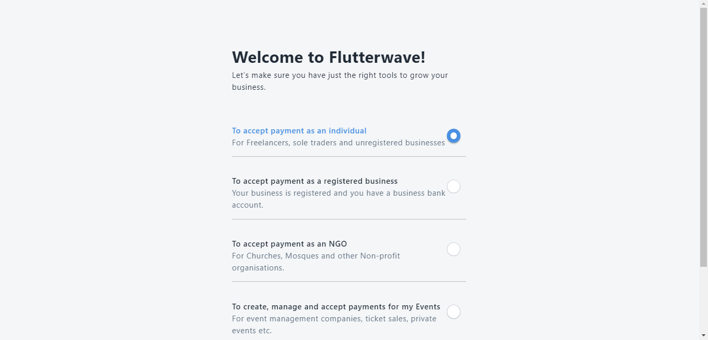

5. You will be asked to provide some documents to verify your identity.
6. Go to _settings_ and  configure your application.

#### Step 3: Integrate Flutterwave
For a transaction to take place with Flutterwave three steps must be completed.
1. Make a payment request
2. Initiate payment
3. Complete payment
4. Verify transaction
We need to first download the ```flutterwave-node-v3``` package. We can now move to the next stage.

```markdown
    yarn add flutterwave-node-v3
```
We are not yet there, lets setup keys that will enable us connect to the flutterwave platform and make payments.
In your [Flutterwave dashboard](https://dashboard.flutterwave.com/dashboard/settings/apis) _settings > api_ your will see all keys required to connect and interact with the Flutterwave payment platform. Open the _app.properties_ and add the following properties, replace placeholders with corresponding key values.

```markdown
    payment.flutterwave.encryptionKey=ENCRIPTION_KEY
    payment.flutterwave.publicKey=PUBLIC_KEY
    payment.flutterwave.secretKey=SECRET_KEY
    payment.flutterwave.redirectUrl=http://localhost:3000/campaign/payment
```
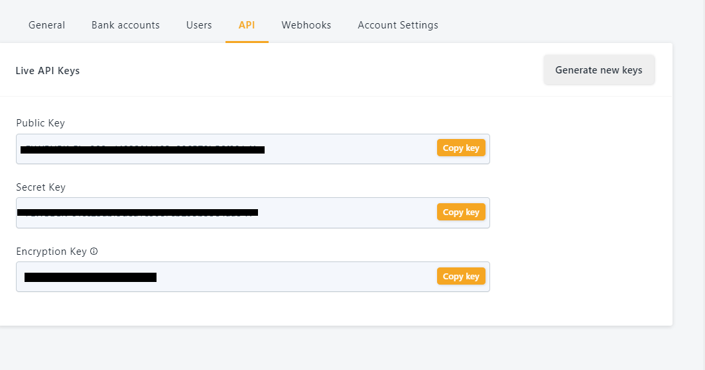

**Make a Card payment request**
Move to the ```PaymentCardWidget``` found in _components\partials\widgets\PaymentCardWidget.js_, this file was shared earlier. Flutterwave requires different information for different card payments. The function```createPaymentRequest``` sends a payload to the server which calls the Charge api endpoint of Flutterwave, the response body returned by Flutterwave contains a meta property which defines the authentication procedure to use to charge or initiate payment on the card. Depending on the card additional information might be needed to complete payment. ```pages\api\transaction\cardPayment.js``` backend controller processes payload from the createPaymentRequest client request.

Flutterwave provides [test cards](https://developer.flutterwave.com/docs/test-cards) to test your code. Make sure on your Flutterwave dashboard you are switched to test mode.

We will be using the test card
Test MasterCard PIN authentication
```markdown
Card number: 5531 8866 5214 2950
cvv: 564
Expiry: 09/32
Pin: 3310
OTP: 12345
```
Payment request payload

```markdown
{
  "name": "John Doe",
  "card_number": "5531886652142950",
  "email": "",
  "cvc": "564",
  "expiry_date": "09 / 32",
  "type": "card",
  "currency": "XAF",
  "amount": 2000,
  "state": "",
  "city": "",
  "address": "",
  "country": "",
  "expiry_month": "09",
  "expiry_year": "32",
  "tx_ref": "100000005",
  "enckey": "xxxxxxxxxxxxxxxxxxxx",
  "redirect_url": "http://localhost:3000/payment"
}
```
**Initiate payment request**
Once an initiate payment request is made the flutterwave returns a response body which specifies what authorization type is needed to initiate a payment.
```markdown
{
  "status": "success",
  "message": "Charge authorization data required",
  "meta": {
    "authorization": {
      "mode": "pin",
      "fields": [
        "pin"
      ]
    }
  }
}
```
The authorization required by the card above is pin. So we will need to provide the pin, we allow for the same payment widget to be used for the payment process. In the payment widget the ```existPaymentRequest``` boolean variable tracks if a payment request has been made, and specifies what handler will be called on the next Pay button click.
```markdown
    <button className="button is-primary" onClick={existPaymentRequest ? initiatePayment : createPaymentRequest}>Pay</button>
```
Our selected card needs a pin to authorize payment, in the payment widget there is logic to request additional information from the user.
```
// components\partials\widgets\PaymentCardWidget.js
    const createPaymentRequest = () => {
        ...
        const postData = {...};
        return axios({...})
        .then((res) => {
             if (res.status === 200) {
                const authMode = res.data.mode;
                switch(authMode) {
                    case 'pin':
                        setAuthType('pin'); // set the authtype required
                        additionalInputRef.current.classList.remove('is-hidden'); // Show additional input needed
                        pinRef.current.classList.remove('is-hidden'); // show pin input
                        addressRef.current.classList.add('is-hidden'); // hide address input
                        setExistPaymentRequest(true);
                        break;
                    case 'avs_noauth':
                        setAuthType('avs_noauth'); // set the authtype required
                        additionalInputRef.current.classList.remove('is-hidden'); // Show additional input needed
                        addressRef.current.classList.remove('is-hidden'); // show address inputs
                        pinRef.current.classList.add('is-hidden'); // hide payment
                        setExistPaymentRequest(true);
                        break;
                    case 'redirect':
                        location.assign(res.data.redirect); // authorization needed redirect to payment url to make payment.                                      
                        break;
                    default:
                }
            } else {
                ...
            }
        })
        .catch((error) => {
            ...
        });
    }
```
The following code section in _components\partials\widgets\PaymentCardWidget.js_ will show additional information based on the type of authentication.
```markdown
    <div className="column payment-methods-content is-hidden" ref={additionalInputRef}>
        <div className="field is-hidden has-text-centered" ref={pinRef}>
            <span>You need to provide additional card details to complete this transaction.</span>
            <input className="input" placeholder="PIN" name="pin" type="text" onChange={handleInputChange} value={pin} />
        </div>
        <div className="address is-hidden has-text-centered" ref={addressRef}>
            <span>You need to provide additional card details to complete this transaction.</span>
            <div className="field">
                <input className="input" name="city" placeholder="City" type="text" onChange={handleInputChange} value={city} />
            </div>
            <div className="field">
                <input className="input" name="address" placeholder="Address" type="text" onChange={handleInputChange} value={address} />
            </div>
            <div className="field">
                <input className="input" placeholder="State" type="text" name="state" onChange={handleInputChange} value={state} />
            </div>
            <div className="field">
                <input className="input" placeholder="Zip" type="text" name="zip" onChange={handleInputChange} value={zip} />
            </div>
            <div className="field">
                <input className="input" placeholder="Country" type="text" name="country" onChange={handleInputChange} value={country} />
            </div>
        </div>
    </div>
```
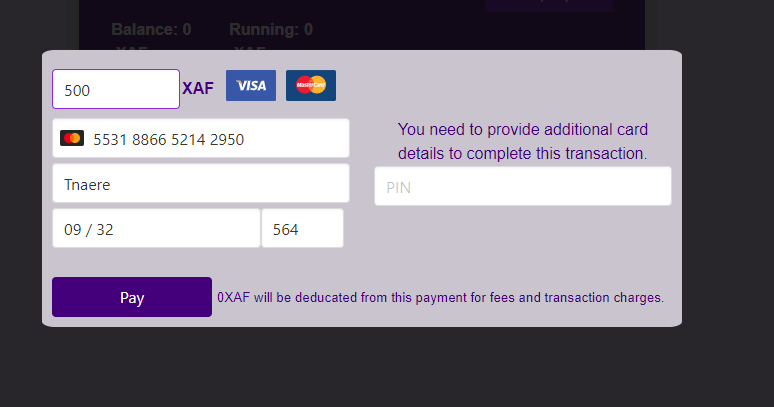

Payload sent to Flutterwave to initiate payment process
```markdown
{
  "name": "Tane",
  "card_number": "5531886652142950",
  "cvc": "564",
  "reason": "Reward",
  "type": "card",
  "currency": "XAF",
  "amount": 2000,
  "authorization": {
    "mode": "pin",
    "pin": "3310"
  },
  "expiry_month": "09",
  "expiry_year": "32",
  "email": "demo@xmail.com",
  "phone_number": "",
  "tx_ref": "100000005",
  "enckey": "xxxxxxxxxxxxxxxxxxxxxxxx",
  "redirect_url": "http://localhost:3000/payment"
}
```

Response on payment initiation
```markdown
{
  "status": "success",
  "message": "Charge initiated",
  "data": {
    "id": 1665371,
    "tx_ref": "100000006",
    "flw_ref": "FLW-MOCK-97ed4f455f5bd4ba5cc4026802f39f29",
    "device_fingerprint": "N/A",
    "amount": 2000,
    "charged_amount": 2000,
    "app_fee": 76,
    "merchant_fee": 0,
    "processor_response": "Please enter the OTP sent to your mobile number 080****** and email te**@rave**.com",
    "auth_model": "PIN",
    "currency": "XAF",
    "ip": "::ffff:10.67.186.14",
    "narration": "CARD Transaction ",
    "status": "pending",
    "auth_url": "N/A",
    "payment_type": "card",
    "plan": null,
    "fraud_status": "ok",
    "charge_type": "normal",
    "created_at": "2020-10-31T04:50:48.000Z",
    "account_id": 118468,
    "customer": {
      "id": 517427,
      "phone_number": null,
      "name": "Anonymous customer",
      "email": "demo@gmail.com",
      "created_at": "2020-10-31T04:50:47.000Z"
    },
    "card": {
      "first_6digits": "553188",
      "last_4digits": "2950",
      "issuer": "MASTERCARD  CREDIT",
      "country": "NG",
      "type": "MASTERCARD",
      "expiry": "09/32"
    }
  },
  "meta": {
    "authorization": {
      "mode": "otp",
      "endpoint": "/v3/validate-charge"
    }
  }
}
```
**Complete payment**
After filling additional details and initating payment, an OTP code is sent to the users email or phonenumber, in our case at the backend I used the current session users email. You can as well add an email or phonenumber input to the PaymentWidget. The different authorizations mode need to be handled differently.
1. With pin authorization, you need to create a page in your app that will accept the OTP and confirm payment.
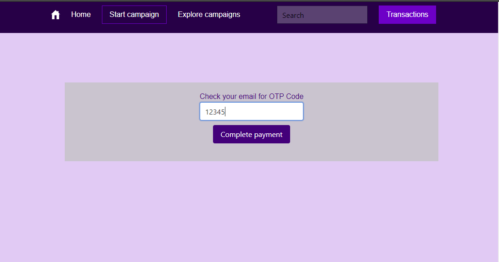

2. with avs_noauth and no authorization , you will be redirected to a flutterwave link to enter the otp code and later redirected to the redirection link entered in the request body during the payment initialization step.
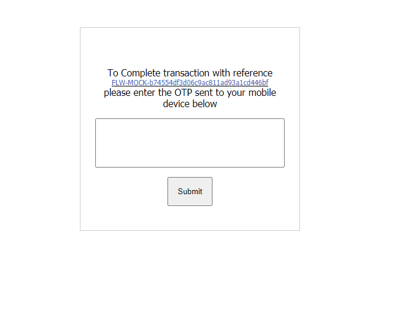

To complete payment we create a payment page ```pages\payment.js```, this has already been created for you. This page does two things.
1. For pin authorization it will accept pin , then call the ```completeCardPayment``` function to complete payment. After payment is completed, the user is redirected to the transaction page.
2. For no authorization modes, the page will gather payment details from the query params, then call the ```completeCardPayment``` function to complete payment. After payment is completed, the user is redirected to the transaction page. Note that the link to the payment page is the redirect url passed during the initiate payment stage of the payment workflow.

Payload sent to Flutterwave to complete payment.
```markdown
{
  "otp": "12345",
  "flw_ref": "FLW-MOCK-6deb1aa461865414a4a274df78397291"
}
```
Response on completing payment
```markdown
    {}
```
**Verify transaction**
In the backend, upon completing payment, a call to verify payment must be made using the Id of the completed transaction. In the payment verification response below data.processor_response is 'successful' indicates that payment was successful. 

Payload sent to Flutterwave 
```markdown
{
    "id":1665320
}
```
Flutterwave response upon verifying payment.
```markdown
{
  status: 'success',
  message: 'Transaction fetched successfully',
  data: {
    id: 1665320,
    tx_ref: '100000005',
    flw_ref: 'FLW-MOCK-6deb1aa461865414a4a274df78397291',
    device_fingerprint: 'N/A',
    amount: 2000,
    currency: 'XAF',
    charged_amount: 2000,
    app_fee: 76,
    merchant_fee: 0,
    processor_response: 'successful',
    auth_model: 'PIN',
    ip: '::ffff:10.65.248.108',
    narration: 'CARD Transaction ',
    status: 'successful',
    payment_type: 'card',
    created_at: '2020-10-31T04:08:49.000Z',
    account_id: 118468,
    card: {
      first_6digits: '553188',
      last_4digits: '2950',
      issuer: ' CREDIT',
      country: 'NIGERIA NG',
      type: 'MASTERCARD',
      token: 'flw-t1nf-dd9f5ed8aceaeb3d0ad66f68e0f2cf5a-m03k',
      expiry: '09/32'
    },
    meta: null,
    amount_settled: 1924,
    customer: {
      id: 517424,
      name: 'Anonymous customer',
      phone_number: 'N/A',
      email: 'demo@xmail.com',
      created_at: '2020-10-31T04:08:48.000Z'
    }
  }
}
```

#### Payment backend
In the backend 2 Controllers files handle client transaction requests. The ```pages\api\transaction\cardPayment.js``` controller manages payment request and payment initiation calls. The ```pages\api\transaction\completeCardPayment.js``` controller handle client requests concerned with validating and verifying card payment was successful. Both the ```PaymentCardHandler``` and ```CompleteCardPaymentHandler``` use functions from the ```helpers\payment.js``` file.

```markdown
// helpers\payment.js

// called to make payment request and initiate payment
export const makePayment = async (payload) => {
    payload.enckey = flwEncKey;
    payload.redirect_url = flwRedUrl;
    const payment = await flw.Charge.card(payload);
    return payment;
}
// finalises a payment
export const completeCardPayment = async (payload) => {
    const completedPayment = flw.Charge.validate(payload);
    return completedPayment;
}
// verifies that payment was done
export const verifyCardPayment = async (payload) => {
    const payment = flw.Transaction.verify(payload);
    return payment;
}
```
### Loading and Updating Transactions
Finally we are done with integrating payment. Now we want to display our transactions. Here we are going to use Hooks and Suspense.


## Support or Contact
Facebook [login](https://developers.facebook.com/docs/facebook-login/)
React [docs](https://reactjs.org/docs/getting-started.html)
Flutterwave V3 Card payment api [docs](https://developer.flutterwave.com/docs/card-payments)
Flutterwave card [test](https://developer.flutterwave.com/docs/test-cards)
Tutorial codebase [repo](https://github.com/tanerochris/spo-tuto-base)
Tutorial [repo](https://github.com/tanerochris/ping-react)
For questions or bugs create an issue on the tutorial codebase repo or tutorial itself.

## Author
Tane J. Tangu, Software Engineer
_Email_ tanejuth@gmail.com
_Twitter_ @tanerochris
_LinkedIn_  https://www.linkedin.com/in/tane-j-tangu-72034ba8/

